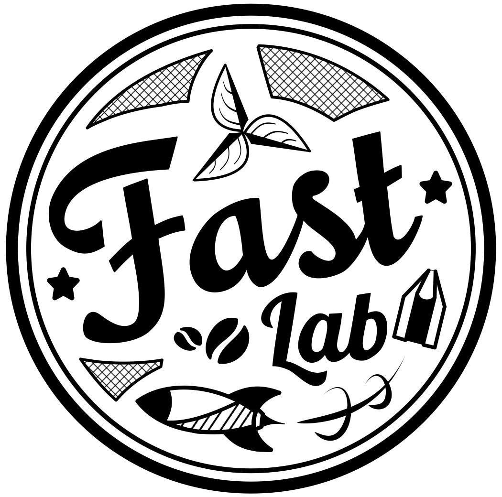

<h1>
FlowDrone: Wind Estimation and Gust Rejection on UAVs using Fast-response Hot-wire Flow Sensors
</h1>
 
<table style="width: 80%; max-width: 800px; margin: 0 auto;">
    <tr>
        <td style="text-align: center; width: 100px;">
            <a href="https://natesimon.github.io/" target="_blank">Nathaniel Simon</a>
        </td>
        <td style="text-align: center; width: 100px;">
            <a href="https://allenzren.github.io/" target="_blank">Allen Z. Ren</a>
        </td>
    </tr>
</table>
<table style="width: 60%; max-width: 800px; margin: 0 auto;">
    <tr>
            <td style="text-align: center; width: 100px;">
            <a href="https://www.linkedin.com/in/alexander-piqu%C3%A9-789317112/" target="_blank">Alexander Piqué</a>
        </td>
    </tr>
</table>
<table style="width: 60%; max-width: 800px; margin: 0 auto;">
    <tr>
        <td style="text-align: center; width: 100px;">
            <a href="https://www.linkedin.com/in/david-snyder-a25387bb/" target="_blank">David Snyder</a>
        </td>
        <td style="text-align: center; width: 100px;">
            <a href="https://www.linkedin.com/in/daphne-barretto/" target="_blank">Daphne Barretto</a>
        </td>
    </tr>
    <tr>
        <td style="text-align: center; width: 100px;">
            <a href="https://irom-lab.princeton.edu/majumdar/" target="_blank">Anirudha Majumdar</a>
        </td>
        <td style="text-align: center; width: 100px;">
            <a href="https://mae.princeton.edu/people/faculty/hultmark" target="_blank">Marcus Hultmark</a>
        </td>
    </tr>
    <tr>
    <td align=center width=40px>

        

    </td>
    <td align=center width=40px>

        

    </td>
    </tr>
</table>
<td align=center style="width: 80%; max-width: 800px; margin: 0 auto; text-align: center;">

<a href="https://robo.princeton.edu/" target="_blank">Princeton University</a>

</td>
<table style="width: 70%; max-width: 800px; margin: 0 auto;">
    <tr>
    <td align=center width=20px>

        

    </td>
    <td align=center width=20px>

        

    </td></tr>
    <tr>
    <td align=center width=20px>
<a href="https://arxiv.org/abs/2210.05857">[PDF]</a>
</td>
    <td align=center width=20px>
<a href="https://youtu.be/uw0p1I9V2CM">[Video]</a>
</td>
    </tr>
</table>
<table style="width: 60%; max-width: 800px; margin: 0 auto;">
    <tr>
        <td align="center" width="40px">
            
                
            
        </td>
        <td align="center" width="40px">
            
                

                    <b>In Proceedings:</b> <a href="https://www.icra2023.org/">ICRA 2023</a>.
                

            
        </td>
    </tr>
    <tr>
        <td align="center" width="40px">
            
                
            
        </td>
         
        <td align="center" width="40px">
            
                

                    <b>Hardware <a href="/projects/flowdrone_build_guide">Build Guide</a>.</b>
                

            
        </td>
    </tr>
</table>
 

    

        

            <iframe class="embed-responsive-item rounded z-depth-1" src="https://www.youtube.com/embed/uw0p1I9V2CM"></iframe>
        

    

This video, "Improving Drone Performance in Wind with Novel, Fast, Sensors" received an Outstanding Presentation Award ($1,500) at the [2023 Princeton Research Day](https://researchday.princeton.edu/present/awards/2023-award-winners).
 

<b>Abstract:</b> Unmanned aerial vehicles (UAVs) are finding use in applications that place increasing emphasis on robustness to external disturbances including extreme wind. However, traditional multirotor UAV platforms do not directly sense wind; conventional flow sensors are too slow, insensitive, or bulky for widespread integration on UAVs. Instead, drones typically observe the effects of wind indirectly through accumulated errors in position or trajectory tracking. In this work, we integrate a novel flow sensor based on micro-electro-mechanical systems (MEMS) hot-wire technology developed in our prior work onto a multirotor UAV for wind estimation. These sensors are omnidirectional, lightweight, fast, and accurate. In order to achieve superior tracking performance in windy conditions, we train a ‘wind-aware’ residual-based controller via reinforcement learning using simulated wind gusts and their aerodynamic effects on the drone. In extensive hardware experiments, we demonstrate the wind-aware controller outperforming two strong ‘wind-unaware’ baseline controllers in challenging windy conditions.

 

<h2>FlowDrone System Overview</h2>

    

    

 

    FlowDrone uses MAST (MEMS Anemometry Sensing Tower), our novel omnidirectional flow sensor, to estimate a wind vector onboard the drone. MAST functions using micro-electro-mechanical (MEMS) hot-wires, which have a sensing bandwidth of 500+ Hz, significantly faster than conventional pressure-based or ultrasonic methods. The MAST voltages are read into the Raspberry Pi, and a neural network sensor model (trained on wind-tunnel data) estimates a corresponding wind direction and magnitude. A short time series of wind data, in addition to the drone's state (from the flight computer), is fed into a learning-based control policy. The output of the control policy is a body rate and thrust setpoint, which is sent back to the flight controller and determines how the drone should react to the incoming gust.

 

<h2>Wind-Aware Control</h2>

    

    

 

    The wind-aware control policy is comprised of two parts: a standard attitude PID controller, and a residual policy that augments the attitude PID controller with learned gust rejection. This captures the baseline behavior of the attitude PID controller, while giving the policy an opportunity to learn and use additional information from the MAST flow sensors. The residual policy is learned <a href="https://github.com/utiasDSL/gym-pybullet-drones">in simulation</a> using reinforcement learning, in a variety of simulated wind gusts. The residual policy takes as input a short history of wind estimates, and thus has the opportunity to learn wind structure and ultimately to predict the forces acting on the drone.

 

<h2>Results: Gust Rejection</h2>

    We compare the performance of our wind-aware controller against two strong baselines. The first baseline (wind-unaware) has the opportunity to learn a residual policy in the same simulated gusts, but without the MAST flow sensor. Any performance improvements of wind-aware over wind-unaware validate the benefit of MAST. The second baseline (baseline) are simply the attitude PID controller, with no learned residual component. Any improvements over baseline validate the benefit of the learned residual policy.

    

    

 

    Across 15x trials, we see that wind-aware (ours -- in blue) outperforms wind-unaware, which in turn outperforms baseline. We see that wind-aware both deviates the least during the gust (Left), and also maintains a tighter concentration around the position setpoint throughout the gust (Right). These experiments demonstrate the benefits of fast flow sensing for the purposes of flow prediction and gust rejection onboard UAVs.

 

    <h3><strong>Citing our Work:</strong></h3>
    
 If you find our work to be relevant to your research, please consider citing our pair of papers:

<!-- <h2>selected publications</h2> -->



 
<h3><strong><a href="/projects/flowdrone_build_guide/">Build Guide</a></strong></h3>
 

For detailed instructions on how we built FlowDrone, check out our [Build Guide](/projects/flowdrone_build_guide/)!